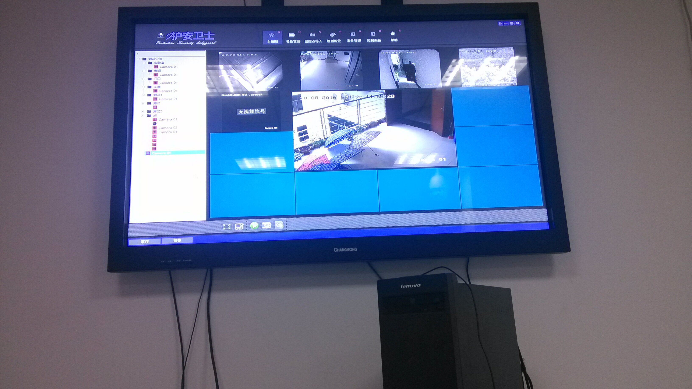
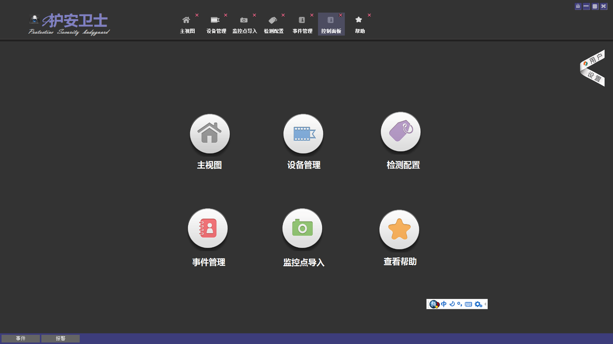
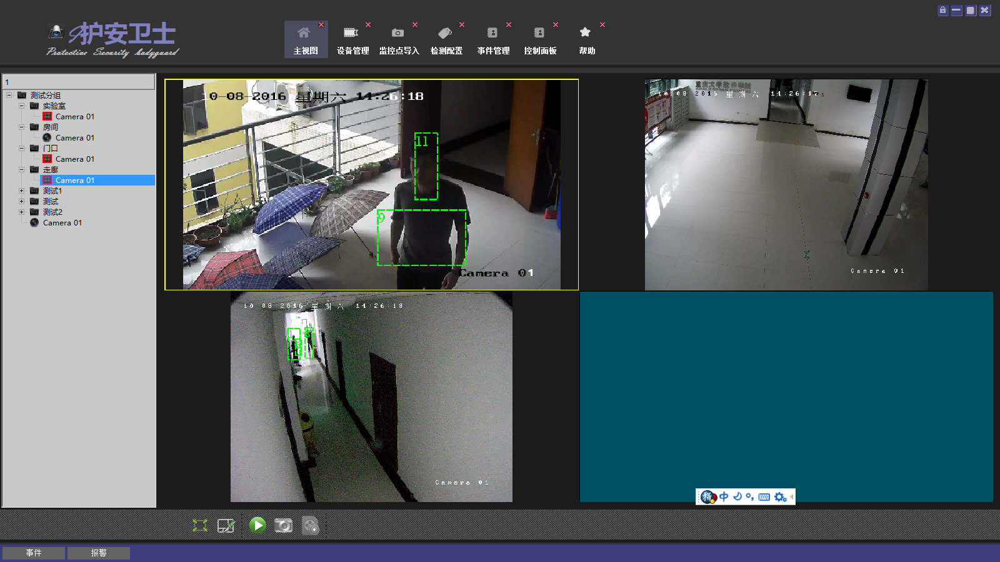
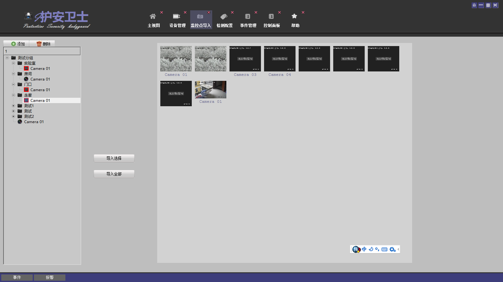

Zhao,Chenqiu(赵晨丘)    {#name}
=====

Researcher & Developer      {#job}
----------

- Phone: [+1 587-****-77](tel://+1 5879377877)
- Email: <zhao.chenqiu@ualberta.ca> <zhaochenqiu@gmail.com>
- Blog: [zhaochenqiu.github.io](https://zhaochenqiu.github.io)
- Github: [zhaochenqiu](https://github.com/zhaochenqiu/)

Summary
-------
***
Hi, welcome to my homepage, i am a researcher as well as a developer of
computer vision who is currently working for my PhD at University of Alberta, Canada.
Previously, i was working as a research associate in Institute
for Media Innovation, IMI, Singapore, Nanyang Technological University, NTU. 
Before that, i was taking my Master and Bachelor degree in Chongqing University, China.
My research interests include Background Subtraction, Video Segmentation, Pattern
Recognition, Machine Learning and Deep Learning. For programming part, i used
to take part in several projects and also led the development of a few practical
projects. Personally, i love programming very much, and C/C++ is my favorite language.
More information about me are available as follows:

Academic Background
---------
***

 - Background Subtraction based on Deep Pixel Distribution Learning, *IEEE International Conference on Multimedia and Expo (ICME), 2018*, **Chenqiu Zhao** ,Tat-Jen Cham, Xinyu Ren, Jianfei Cai, paper, [demo](https://www.youtube.com/watch?v=RWJYTfUCksY&t=122s), [code](https://github.com/zhaochenqiu/DPDL)

 - Background Subtraction based on Random Super-pixels under Multiple Scales for Video Analytics, *IEEE Access, 2018*,  Weitao fang, Tingting zhang, **Chenqiu zhao**, Danyal badar soomro, Rizwan taj and Haibo hu,

 - Background Subtraction based on Alternative Cues in Freely Moving Camera, *IEEE Transactions on Circuits and Systems for Video Technology , 2018*, **Chenqiu Zhao**, Aneeshan Sain, Ying Qu, Yongxin Ge, Haibo Hu, paper, [demo](https://www.youtube.com/watch?v=ss4VIRWq6X8&t=235s), [code](https://github.com/zhaochenqiu/IntegrationFgBk)
 
 - Background Modeling by Stability of Adaptive Features in Complex Scenes, *IEEE Transactions on Image Processing, 2018*,  Dan Yang,  **Chenqiu Zhao** , Xiaohong Zhang, Sheng Huang, [paper](https://ieeexplore.ieee.org/document/8091284/), demo, code

 - Collaborative Sparse Preserving Projections for Feature Extraction, *IEEE International Conference on Service Science, 2016*, Yunsong Wu, Qianying Huang, Xiaohong Zhang, **Chenqiu Zhao**, [paper](https://ieeexplore.ieee.org/document/8057406/)
 
 - Background Subtraction based on Super-pixels under Multi-Scale in Complex Scenes, *Chinese Conference on Pattern Recognition, 2016*. **Chenqiu Zhao**, Tingting Zhang, Qianying Huang, .etc, [paper](https://link.springer.com/chapter/10.1007%2F978-981-10-3002-4_33), demo, [code](https://github.com/zhaochenqiu/SPMS)

 - Category Guided Sparse Preserving Projection for Biometric Data Dimensionality Reduction, *Chinese Conference on Biometric Recognition, 2016*, Qianying Huang, Yunsong Wu,** Chenqiu Zhao**, Xiaohong Zhang, Dan Yang: [paper](Category Guided Sparse Preserving Projection for Biometric Data Dimensionality Reduction)

 - Vehicle Detection Research Based on USILTP Operator, *MATEC Web of Conferences, 2015*, Fei Li, Xiaohong Zhang, **Chenqiu Zhao**, Meng Yan, [paper](https://www.matec-conferences.org/articles/matecconf/pdf/2015/03/matecconf_iceta2015_01048.pdf)

 - Background modeling based on adaptive neighborhood correlation (chinese), *Journal of Image and Graphics(中国图象图形学报), china, 2015*.   Wan Jian,Hong Mingjian,  **Zhao Chenqiu**, [paper](http://kns.cnki.libcon.bupt.edu.cn/KCMS/detail/detail.aspx?dbcode=CJFQ&dbname=CJFDLAST2017&filename=ZGTB201609009&uid=WEEvREcwSlJHSldRa1FhdkJkVWI3QlZHOFlxSVRXbHdkSkZwRUk2Zldwcz0=$9A4hF_YAuvQ5obgVAqNKPCYcEjKensW4ggI8Fm4gTkoUKaID8j8gFw!!&v=MjAyNzBSb0Z5em1XNy9KUHlyZmJMRzRIOWZNcG85RmJZUjhlWDFMdXhZUzdEaDFUM3FUcldNMUZyQ1VSTEtmWSs=)

 - Vehicle Detection Research Based on an adaptive SILTP Algorithm (chinese), *Computer Science(计算机科学学报), china, 2015*, Li fei, Zhang Xiahong,  **Zhao Chenqiu**, Yan Meng, [paper](http://kns.cnki.libcon.bupt.edu.cn/KCMS/detail/detail.aspx?dbcode=CJFQ&dbname=CJFDLAST2016&filename=JSJA201606060&uid=WEEvREcwSlJHSldRa1FhdkJkVWI3QlZHOFlxSVRXbHdkSkZwRUk2Zldwcz0=$9A4hF_YAuvQ5obgVAqNKPCYcEjKensW4ggI8Fm4gTkoUKaID8j8gFw!!&v=MDQwMTR6bVc3L0pMejdCYjdHNEg5Zk1xWTlEWklSOGVYMUx1eFlTN0RoMVQzcVRyV00xRnJDVVJMS2ZZK1JvRnk=)

 - A Moving Objects Detection Method in Video Sequence, *Licensed patent, Patent Numbers:CN103971385B, granted in China, 2014*.  Xiaohong Zhang,  **Chenqiu Zhao** , .etc, [online check](http://cpquery.sipo.gov.cn/txnQueryBibliographicData.do?select-key:shenqingh=2014102280740&select-key:gonggaobj=1&select-key:backPage=http%3A%2F%2Fcpquery.sipo.gov.cn%2FtxnQueryOrdinaryPatents.do%3Fselect-key%3Ashenqingh%3D%26select-key%3Azhuanlimc%3D%25E8%25A7%2586%25E9%25A2%2591%25E4%25B8%25AD%25E8%25BF%2590%25E5%258A%25A8%25E7%2589%25A9%25E4%25BD%2593%25E7%259A%2584%25E6%25A3%2580%25E6%25B5%258B%25E6%2596%25B9%25E6%25B3%2595%26select-key%3Ashenqingrxm%3D%25E9%2587%258D%25E5%25BA%2586%25E5%25A4%25A7%25E5%25AD%25A6%26select-key%3Azhuanlilx%3D%26select-key%3Ashenqingr_from%3D%26select-key%3Ashenqingr_to%3D%26verycode%3D2%26inner-flag%3Aopen-type%3Dwindow%26inner-flag%3Aflowno%3D1524812739090&token=0781CD24335C4D329A10C1A174B8C542&inner-flag:open-type=window&inner-flag:flowno=1524812766312)
 
 - Human-computer interaction game system, *Licensed patent, Patent Numbers: CN103399628A, granted in China, 2013*, Ji Liu, Yuan Wan, Liangjun Wu, Chenqiu Zhao, Chen Shen. [online check](http://cpquery.sipo.gov.cn/txnQueryBibliographicData.do?select-key:shenqingh=2013101808783&select-key:gonggaobj=1&select-key:backPage=http%3A%2F%2Fcpquery.sipo.gov.cn%2FtxnQueryOrdinaryPatents.do%3Fselect-key%3Ashenqingh%3D%26select-key%3Azhuanlimc%3D%25E4%25B8%2580%25E7%25A7%258D%25E4%25BA%25BA%25E6%259C%25BA%25E4%25BA%25A4%25E4%25BA%2592%25E6%25B8%25B8%25E6%2588%258F%25E7%25B3%25BB%25E7%25BB%259F%26select-key%3Ashenqingrxm%3D%25E9%2587%258D%25E5%25BA%2586%25E5%25A4%25A7%25E5%25AD%25A6%26select-key%3Azhuanlilx%3D%26select-key%3Ashenqingr_from%3D%26select-key%3Ashenqingr_to%3D%26verycode%3D14%26inner-flag%3Aopen-type%3Dwindow%26inner-flag%3Aflowno%3D1524812969104&token=2CED253558544D8C855C0D1E779AFAC8&inner-flag:open-type=window&inner-flag:flowno=1524812973908)

Engineering Background
------------
***
 - 2016, The Video Abstraction System based on Hadoop, Project Leader, *The Chongqing Graduate Student Research Innovation Project (重庆市研究生科研创新项目) (Grant no.CYB14012)* [online check](http://graduate.cqu.edu.cn/newsdetail.action?newsinfoid=59620)

 - 2015, Intelligent Video Analytics(IVA), Project Member, The Project of ISSE Laboratory, Chongqing University, China. An Video Surveillance System. **This project is purely developed by C++**

 &nbsp;  &nbsp; &nbsp; 

 - 2013 Photoshark, Project Leader, The Graduation Project of Chongqing University. An Image Processing Software Similar to Photoshop but Simpler. on building

 - 2013 Microsoft Image Cup 2013, the Second Prize of China. on building

 - 2012 Programming in International Business Machines, the Personal Second Prize of China, on building 

Coding Skills
-----------
Those things which enjoy routine usage in my daily work are denoted with a ^†^ symbol.

### Programming & Scripting Languages
- C/C++ ^†^
- Matlab ^†^
- Tex ^†^
- Markdown ^†^
- Shell ^†^
- Lex ^†^
- Python
- Lua
- Batch
- Java
- C#
- HTML

### Framework & Tools & APIs
- G++ ^†^
- Matlab ^†^
- Texlive ^†^
- Vim ^†^
- VC++ (Windows API) ^†^
- MFC ^†^
- QT ^†^
- OpenCV
- MexOpenCV
- OpenGL & DirectX
- Nodejs
- Hexo
- Mathjax
- Flex
- Pandoc

Interests
---------
- Coding
- Computer games (StarCraft II, Civilization VI, Real-time Strategy Games, Dark Souls 3 ...)

